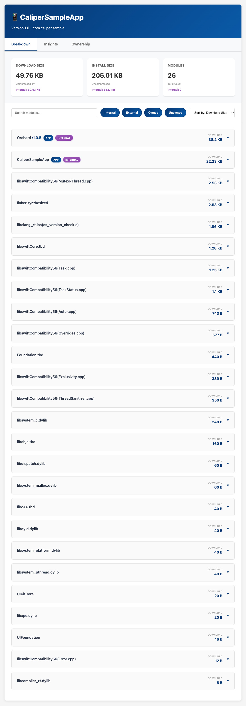
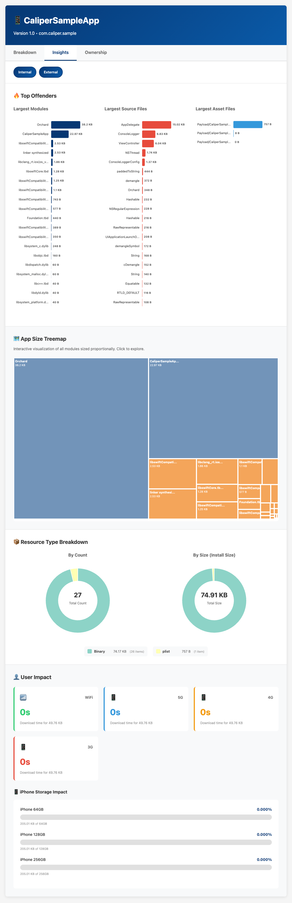
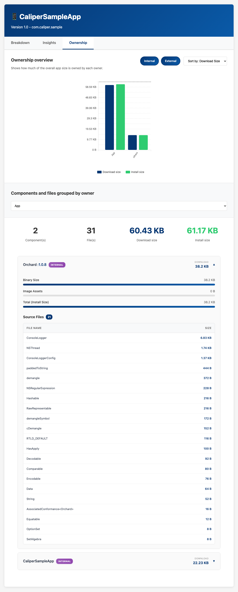
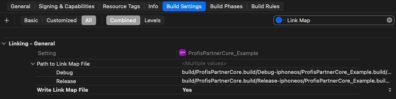

# Caliper

[](https://github.com/kibotu/caliper/actions/workflows/build.yml) [](https://github.com/kibotu/caliper/tags)
[](https://developer.apple.com/documentation/ios-ipados-release-notes/ios-ipados-26-release-notes)
[](https://www.swift.org/blog/announcing-swift-6/)

Analyze iOS app bundle sizes, track module ownership, and generate detailed size reports. Helps iOS teams monitor and optimize app size metrics for App Store submissions and performance tracking.

## Screenshots

<table>
  <tr>
    <td width="33%">
      <a href="docs/breakdown.png">
        
      </a>
      <p align="center"><em>Module Size Breakdown</em></p>
    </td>
    <td width="33%">
      <a href="docs/insights.png">
        
      </a>
      <p align="center"><em>Size Insights</em></p>
    </td>
    <td width="33%">
      <a href="docs/ownership.png">
        
      </a>
      <p align="center"><em>Module Ownership</em></p>
    </td>
  </tr>
</table>

## Quick Start

```bash
# Build
swift build -c release

# Analyze IPA with all features
.build/release/caliper \
  --ipa-path MyApp.ipa \
  --link-map-path MyApp-LinkMap.txt \
  --ownership-file module-ownership.yml \
  --package-resolved-path Package.resolved
```

Generates `report.json` and `report.html` in the current directory.

## Features

- **Binary Size Analysis** - Accurate per-module binary sizes from LinkMap files
- **Asset Tracking** - Detailed breakdown of images, storyboards, and resources
- **Module Ownership** - Track which team owns which modules
- **Version Tracking** - Swift package version information from Package.resolved
- **Interactive Reports** - Searchable HTML reports with filtering and sorting
- **Size Metrics** - Both compressed (IPA) and uncompressed (installed) sizes
- **Automatic App Detection** - Identifies and tags main app module automatically

## Installation

### Build from Source

```bash
git clone https://github.com/kibotu/caliper.git
cd caliper
swift build -c release

# Binary will be at: .build/release/caliper
```

### System-wide Install

```bash
make install
# Installs to /usr/local/bin/caliper
```

### Swift Mint

```bash
# Install
mint install kibotu/caliper

# Run
mint run kibotu/caliper --ipa-path MyApp.ipa

# Or install globally
mint install kibotu/caliper@main
caliper --ipa-path MyApp.ipa
```

## Usage

### Basic IPA Analysis

Minimum required input - analyzes bundle structure and resources:

```bash
.build/release/caliper --ipa-path MyApp.ipa
```

### With Binary Size Data

Add LinkMap for accurate per-module binary sizes:

```bash
.build/release/caliper \
  --ipa-path MyApp.ipa \
  --link-map-path MyApp-LinkMap.txt
```

**How to generate LinkMap:**
1. Xcode → Build Settings
2. Search for "Write Link Map File"
3. Set to `YES`
4. Build your app
5. Find LinkMap at: `~/Library/Developer/Xcode/DerivedData/YourApp-xxx/Build/Intermediates.noindex/YourApp.build/Release-iphoneos/YourApp.build/YourApp-LinkMap-normal-arm64.txt`

[](docs/xcode-link-map.png)

### With Module Ownership

Track which team owns which modules:

```bash
.build/release/caliper \
  --ipa-path MyApp.ipa \
  --link-map-path MyApp-LinkMap.txt \
  --ownership-file module-ownership.yml
```

**module-ownership.yml example:**

```yaml
# Pattern matching with wildcards
- identifier: "*CoreFeature*"
  owner: Core Team
  internal: true

- identifier: "MyApp"
  owner: App Team
  internal: true

- identifier: "ThirdParty*"
  owner: External
```

**Pattern syntax:**
- `*` = any characters
- `?` = single character
- `internal: true` = marks as first-party code
- `owner` = team/group name for reporting

**Note:** The main app module is automatically tagged with `owner: "App"` and `internal: true` even without an ownership file.

### With Package Versions

Include Swift package version information:

```bash
.build/release/caliper \
  --ipa-path MyApp.ipa \
  --link-map-path MyApp-LinkMap.txt \
  --package-resolved-path Package.resolved
```

**Where to find Package.resolved:**
- Xcode projects: `YourProject.xcodeproj/project.xcworkspace/xcshareddata/swiftpm/Package.resolved`
- SPM projects: `Package.resolved` in project root

### With Package Name Mapping

For namespaced packages (e.g., internal packages):

```bash
.build/release/caliper \
  --ipa-path MyApp.ipa \
  --link-map-path MyApp-LinkMap.txt \
  --package-resolved-path Package.resolved \
  --package-mapping-file package-name-mapping.yml
```

**package-name-mapping.yml example:**

```yaml
- moduleName: AdjustSDK
  packageIdentity: com.company.adjust-sdk

- moduleName: InternalCore
  packageIdentity: internal.core-framework
```

## Parameters

| Parameter | Required | Description |
|-----------|----------|-------------|
| `--ipa-path` | ✅ Yes | Path to the IPA file to analyze |
| `--link-map-path` | ⬜ No | Path to LinkMap file for accurate binary sizes |
| `--ownership-file` | ⬜ No | YAML file with module ownership patterns |
| `--package-resolved-path` | ⬜ No | Path to Package.resolved for version tracking |
| `--package-mapping-file` | ⬜ No | YAML file for namespaced package mappings |

## Data Sources

| Data Type | Source | Compression | Notes |
|-----------|--------|-------------|-------|
| **Module Names** | IPA structure (.framework, .bundle) | - | Extracted from bundle hierarchy |
| **Binary Sizes** | LinkMap file | Uncompressed | Compiled code size per module |
| **Asset Sizes** | IPA + .car files | Both | Images: compressed (IPA) + uncompressed (installed) |
| **Resource Files** | IPA archive | Compressed | .plist, .strings, .nib, .storyboardc, etc. |
| **Package Versions** | Package.resolved | - | Swift package dependency versions |
| **Total IPA Size** | IPA file | Compressed | Download/App Store size |
| **Total Install Size** | Unzipped IPA | Uncompressed | Actual installed app size |
| **Asset Catalog Details** | .car files via assetutil | Uncompressed | Parsed with xcrun assetutil |

### Compressed vs Uncompressed

- **Compressed** (in IPA): What users download from App Store
- **Uncompressed**: Actual size on device after installation
- **Binary sizes** (from LinkMap): Always uncompressed executable code
- **Asset compression**: Varies by file type (PNG, JPEG, etc.)

## Output

### JSON Report (`report.json`)

```json
{
  "app": {
    "name": "MyApp",
    "version": "1.2.3",
    "bundleId": "com.company.myapp"
  },
  "modules": {
    "CoreModule": {
      "name": "CoreModule",
      "owner": "Core Team",
      "internal": true,
      "version": "2.1.0",
      "binarySize": 1234567,
      "imageSize": 234567,
      "imageFileSize": 345678,
      "proguard": 2345678,
      "resources": {
        "png": { "size": 123456, "count": 42 },
        "storyboardc": { "size": 45678, "count": 3 }
      },
      "top": {
        "Assets.car": 98765,
        "Background.png": 12345
      }
    }
  },
  "totalPackageSize": 12345678,
  "totalInstallSize": 23456789
}
```

**Field descriptions:**

| Field | Unit | Description |
|-------|------|-------------|
| `binarySize` | bytes | Compiled code size (from LinkMap) |
| `imageSize` | bytes | Compressed image assets in IPA |
| `imageFileSize` | bytes | Uncompressed image assets |
| `proguard` | bytes | Total uncompressed module size |
| `resources` | object | File types with size and count |
| `top` | object | Top 30 largest files in module |
| `totalPackageSize` | bytes | IPA file size (compressed) |
| `totalInstallSize` | bytes | Installed app size (uncompressed) |

### HTML Report (`report.html`)

Interactive web interface with:
- 🔍 Search and filter modules
- 📊 Sort by size, binary size, or name
- 📂 Expandable module details
- 🎨 Resource breakdowns by file type
- 📈 Top 10 largest files per module
- 👥 Filter by owner/team
- 🏷️ Internal vs external module filtering

## CI/CD Integration

### Jenkins Pipeline

```groovy
pipeline {
    agent any
    
    stages {
        stage('Build App') {
            steps {
                // Your app build steps here
                sh 'xcodebuild -configuration Release ...'
            }
        }
        
        stage('Analyze App Size') {
            steps {
                // Clone and build Caliper
                dir('caliper') {
                    git url: 'https://github.com/kibotu/caliper.git'
                    sh 'swift build -c release'
                }
                
                // Run analysis
                sh '''
                    caliper/.build/release/caliper \
                        --ipa-path build/MyApp.ipa \
                        --link-map-path build/LinkMap.txt \
                        --ownership-file config/module-ownership.yml \
                        --package-resolved-path Package.resolved
                '''
                
                // Archive reports
                archiveArtifacts artifacts: 'report.json,report.html', allowEmptyArchive: false
                
                // Publish HTML report
                publishHTML([
                    reportDir: '.',
                    reportFiles: 'report.html',
                    reportName: 'App Size Report',
                    keepAll: true,
                    alwaysLinkToLastBuild: true
                ])
            }
        }
        
        stage('Check Size Thresholds') {
            steps {
                script {
                    // Parse JSON and check thresholds
                    def report = readJSON file: 'report.json'
                    def maxSize = 100 * 1024 * 1024 // 100 MB
                    
                    if (report.totalPackageSize > maxSize) {
                        error "App size ${report.totalPackageSize} exceeds threshold ${maxSize}"
                    }
                }
            }
        }
    }
}
```

### GitHub Actions

```yaml
name: App Size Analysis

on:
  pull_request:
    branches: [main]
  push:
    branches: [main]

jobs:
  analyze:
    runs-on: macos-13
    
    steps:
      - name: Checkout Code
        uses: actions/checkout@v4
      
      - name: Setup Xcode
        uses: maxim-lobanov/setup-xcode@v1
        with:
          xcode-version: '15.0'
      
      - name: Build App
        run: |
          xcodebuild -workspace MyApp.xcworkspace \
            -scheme MyApp \
            -configuration Release \
            -archivePath build/MyApp.xcarchive \
            archive
          
          xcodebuild -exportArchive \
            -archivePath build/MyApp.xcarchive \
            -exportPath build \
            -exportOptionsPlist ExportOptions.plist
      
      - name: Checkout Caliper
        uses: actions/checkout@v4
        with:
          repository: kibotu/caliper
          path: caliper
      
      - name: Build Caliper
        run: |
          cd caliper
          swift build -c release
      
      - name: Analyze App Size
        run: |
          caliper/.build/release/caliper \
            --ipa-path build/MyApp.ipa \
            --link-map-path build/LinkMap.txt \
            --ownership-file config/module-ownership.yml \
            --package-resolved-path MyApp.xcodeproj/project.xcworkspace/xcshareddata/swiftpm/Package.resolved
      
      - name: Upload Reports
        uses: actions/upload-artifact@v4
        with:
          name: size-reports
          path: |
            report.json
            report.html
          retention-days: 90
      
      - name: Comment PR with Size
        if: github.event_name == 'pull_request'
        uses: actions/github-script@v7
        with:
          script: |
            const fs = require('fs');
            const report = JSON.parse(fs.readFileSync('report.json', 'utf8'));
            const sizeMB = (report.totalPackageSize / 1024 / 1024).toFixed(2);
            const installMB = (report.totalInstallSize / 1024 / 1024).toFixed(2);
            
            const body = `## 📊 App Size Report
            
            - **IPA Size:** ${sizeMB} MB
            - **Install Size:** ${installMB} MB
            - **Modules:** ${Object.keys(report.modules).length}
            
            [View detailed report](../actions/runs/${context.runId})`;
            
            github.rest.issues.createComment({
              issue_number: context.issue.number,
              owner: context.repo.owner,
              repo: context.repo.repo,
              body: body
            });
```

## Required Tools

Caliper requires the following command-line tools to be installed:

| Tool | Usage | Installation | Version Check |
|------|-------|--------------|---------------|
| **Swift** | Build Caliper | Xcode Command Line Tools | `swift --version` |
| **unzip** | Extract IPA files | Pre-installed on macOS | `unzip -v` |
| **xcrun** | Run Xcode tools | Xcode Command Line Tools | `xcrun --version` |
| **assetutil** | Parse .car asset catalogs | Part of iOS SDK | `xcrun --sdk iphoneos assetutil --version` |

### Install Xcode Command Line Tools

```bash
xcode-select --install
```

### Verify Installation

```bash
# Check Swift
swift --version
# Should show: Swift version 6.0 or later

# Check unzip
which unzip
# Should show: /usr/bin/unzip

# Check xcrun
xcrun --version
# Should show: xcrun version X.X

# Check assetutil availability
xcrun --sdk iphoneos assetutil --version 2>/dev/null && echo "✅ assetutil available" || echo "❌ assetutil not found"
```

## Requirements

- **macOS** 14.0 or later
- **Xcode** 16.0 or later
- **Swift** 6.0 or later
- **Xcode Command Line Tools** (includes unzip, xcrun, assetutil)

## Troubleshooting

### "assetutil not found" or .car parsing fails

**Solution:** Install full Xcode (not just Command Line Tools):
```bash
# Install from Mac App Store or:
xcode-select --install
sudo xcode-select --switch /Applications/Xcode.app
```

### LinkMap file not found

**Solution:** Enable LinkMap generation in Xcode:
1. Project Settings → Build Settings
2. Search: "Write Link Map File"
3. Set to: `YES`
4. Clean and rebuild

### Module names don't match Package.resolved

**Solution:** Use `--package-mapping-file` to map module names to package identities.

### Large IPA takes too long

**Solution:** The tool processes files sequentially. Progress is shown in the terminal. For very large IPAs (>500MB), analysis may take 2-5 minutes.

## Inspiration

Inspired by [Spotify's Ruler](https://github.com/spotify/ruler) - adapted for iOS with native Swift implementation and iOS-specific features like asset catalog parsing and LinkMap analysis.

## Contributing

Contributions welcome! This tool helps iOS teams monitor and optimize app size metrics.

## License

```
Copyright 2025 Jan Rabe & CHECK24

Licensed under the Apache License, Version 2.0 (the "License");
you may not use this file except in compliance with the License.
You may obtain a copy of the License at

   http://www.apache.org/licenses/LICENSE-2.0

Unless required by applicable law or agreed to in writing, software
distributed under the License is distributed on an "AS IS" BASIS,
WITHOUT WARRANTIES OR CONDITIONS OF ANY KIND, either express or implied.
See the License for the specific language governing permissions and
limitations under the License.
```
